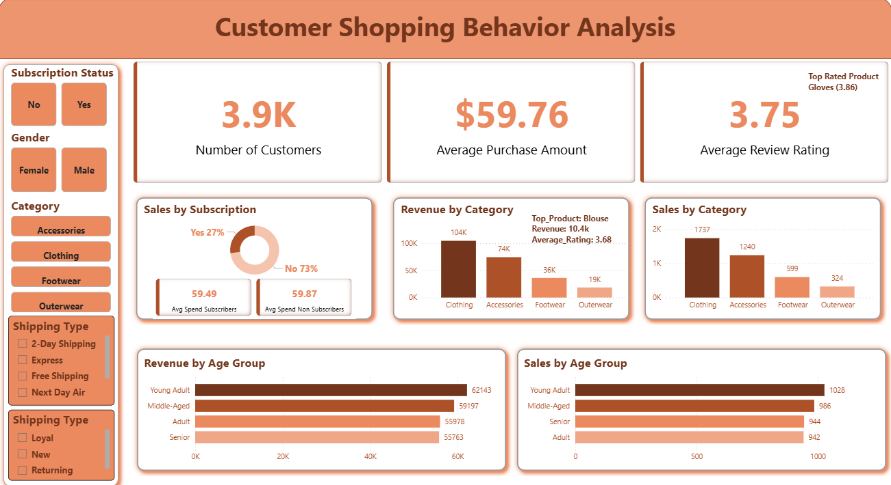

# Customer Shopping Behavior Analysis

## Project Overview
This project analyzes customer shopping behavior using transactional retail data to uncover spending patterns, customer segments, product performance, and subscription trends.

The primary objective was to transform raw customer transaction data into **actionable business insights** that support strategic decision-making in retail operations, customer retention, and product positioning.

The project follows an **end-to-end analytics workflow**:
- Data cleaning and preprocessing in **Python**
- Business analysis in **MySQL**
- Interactive dashboard development in **Power BI**

---

## Business Problem
Retail businesses often struggle to understand:

- Which customer segments generate the highest revenue
- Whether subscriptions improve customer value
- Which products perform best across categories
- How discounts affect purchase behavior
- Which age groups and customer segments should be targeted

This project aims to answer these questions using data-driven analysis.

---

## Dataset Information
**Source:** Kaggle  
Customer Shopping Behavior Dataset  
https://www.kaggle.com/datasets/ayeshasiddiqa123/customer-shopping-behavior-dataset/data

### Dataset Summary
- **Rows:** 3,900+
- **Columns:** 18
- **Features include:**
  - Customer demographics
  - Product category
  - Purchase amount
  - Review rating
  - Shipping type
  - Subscription status
  - Previous purchases
  - Discount applied
  - Season

---

## Tools & Technologies Used
- **Python (Pandas, NumPy)** – Data cleaning & preprocessing
- **MySQL** – Business analysis queries
- **Power BI** – Dashboard and KPI visualization
- **DAX** – KPI cards, customer segmentation, dynamic insights

---

## Data Cleaning & Preparation
The dataset was first cleaned and standardized using Python.

### Key preprocessing steps
- Missing value handling for review ratings
- Column name standardization
- Customer age grouping
- Data consistency checks
- Feature engineering
- Customer segmentation preparation

### Customer Segmentation Logic
Customers were segmented into:

- **New** → 1 previous purchase
- **Returning** → 2–10 previous purchases
- **Loyal** → 11+ previous purchases

This segmentation was later implemented in Power BI using DAX.

---

## SQL Business Analysis
The cleaned dataset was loaded into **MySQL** to answer key business questions.

### Key SQL analyses performed
1. Revenue by gender
2. Subscriber vs non-subscriber spending
3. High-spending discount users
4. Shipping type comparison
5. Discount-dependent products
6. Top 3 products by category
7. Customer segmentation analysis
8. Repeat buyers vs subscription behavior
9. Revenue by age group
10. Product rating analysis

---

## Key Insights
### Revenue Insights
- Highest-performing category generated **$104K+ revenue**
- Average purchase value: **$59.76**

### Product Insights
- Top-selling products crossed **170+ orders**
- Product performance analyzed by category and rating

### Customer Insights
- Clear segmentation into **New, Returning, and Loyal customers**
- Repeat buyers showed stronger revenue contribution
- Subscription behavior compared against average spend

---

## Business Recommendations
Based on the analysis, the following strategic recommendations were derived:

### 1. Customer Retention
Develop loyalty programs targeting **returning customers** to convert them into loyal repeat buyers.

### 2. Product Positioning
Promote top-performing products with high order volumes in marketing campaigns.

### 3. Discount Optimization
Review products heavily dependent on discounts to protect margins.

### 4. Subscription Growth
Strengthen subscriber benefits where customer lifetime value is higher.

### 5. Targeted Marketing
Focus campaigns on high-revenue age groups and customer segments.

---

## Dashboard
The Power BI dashboard includes:

- KPI cards
- Revenue by category
- Sales by subscription
- Revenue by age group
- Customer segment slicers
- Product performance insights

Dashboard screenshot:

---

## Project Outcome
This project demonstrates how transactional customer data can be converted into **business-focused insights and strategic actions** through SQL analysis and interactive BI storytelling.

It showcases end-to-end capabilities in:
- data cleaning
- SQL business querying
- dashboard design
- KPI reporting
- business recommendations

---

## Author
**Abhiram Chiyyarath Devanand**  
Data Analyst | SQL | Power BI | Python | Excel
